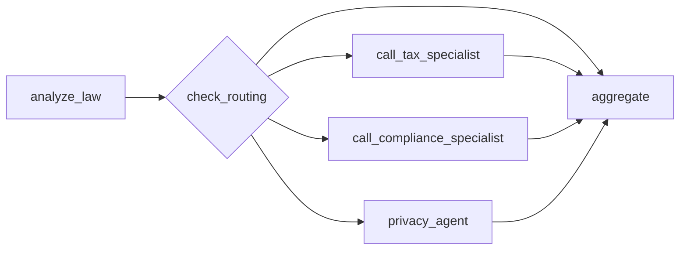
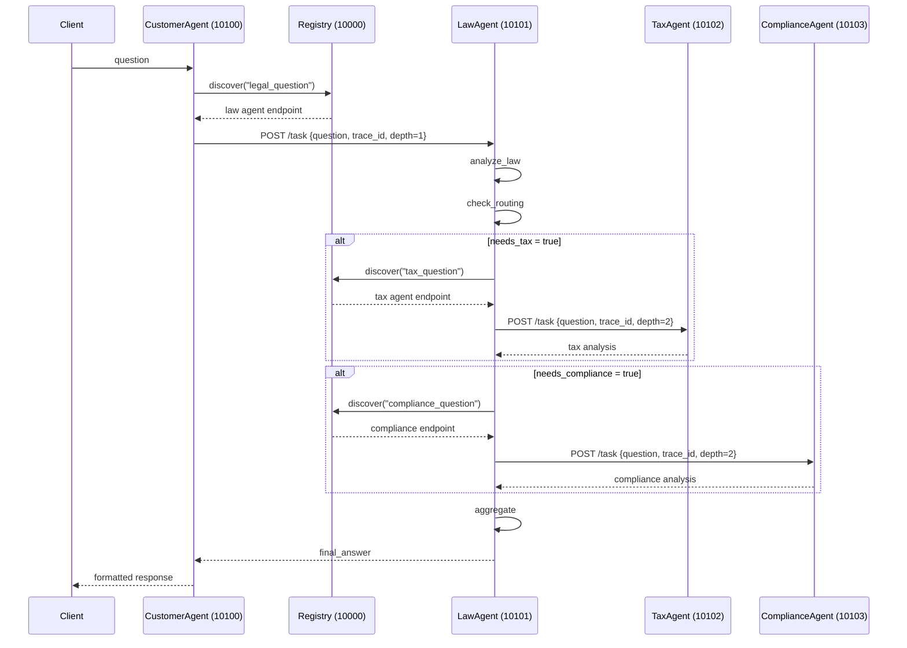

# Lab Solution

## Phần 1: Direct LLM Calling

### Câu hỏi lý thuyết

1. LLM được khởi tạo như thế nào?

- Hàm `get_llm()` nằm trong `common/llm.py`.
- LLM được tạo bằng `ChatOpenAI(...)` nhưng trỏ tới OpenRouter qua `openai_api_base="https://openrouter.ai/api/v1"`.
- Model lấy từ biến môi trường `OPENROUTER_MODEL`, mặc định là `anthropic/claude-sonnet-4-5`.
- API key lấy từ `OPENROUTER_API_KEY`.
- Đã thêm `temperature=0.3`.

2. Message được gửi đến LLM có cấu trúc gì?

- Là một list gồm 2 message:
  - `SystemMessage`: đặt vai trò và cách trả lời cho mô hình.
  - `HumanMessage`: chứa câu hỏi thực tế từ người dùng.

Ví dụ trong `stages/stage_1_direct_llm/main.py`:

```python
messages = [
    SystemMessage(
        content=(
            "You are a legal expert. Provide a clear, concise analysis "
            "of the legal question asked. Keep your response under 300 words."
        )
    ),
    HumanMessage(content=QUESTION),
]
```

3. Tại sao cần có `SystemMessage` và `HumanMessage`?

- `SystemMessage` dùng để định nghĩa vai trò, tone, phạm vi và ràng buộc trả lời của LLM.
- `HumanMessage` là input thực tế của người dùng.
- Tách riêng 2 loại message giúp mô hình hiểu đâu là instruction cố định, đâu là câu hỏi cần xử lý.

### Bài tập 1.1

- Có thể đổi `QUESTION` sang ví dụ:

```python
QUESTION = "Người lao động bị sa thải trái luật ở Việt Nam có thể yêu cầu những quyền lợi gì?"
```

### Bài tập 1.2

- Trong code hiện tại, `common/llm.py` đã thêm sẵn:

```python
temperature=0.3
```

- Ý nghĩa: giảm độ ngẫu nhiên, làm câu trả lời ổn định hơn giữa các lần chạy.

---

## Phần 2: LLM + RAG & Tools

### Câu hỏi lý thuyết

1. Hàm `@tool` decorator được dùng ở đâu?

- Dùng để khai báo các tool mà LLM có thể gọi trong `stages/stage_2_rag_tools/main.py`.
- Các tool hiện có:
  - `search_legal_database`
  - `calculate_damages`
  - `check_statute_of_limitations`

2. `LEGAL_KNOWLEDGE` được cấu trúc như thế nào?

- Là một list các dictionary.
- Mỗi entry có các field:
  - `id`: định danh tài liệu/nguồn tri thức
  - `keywords`: danh sách từ khóa để match truy vấn
  - `text`: nội dung pháp lý tương ứng

Ví dụ:

```python
{
    "id": "labor_law",
    "keywords": ["lao động", "sa thải", "hợp đồng lao động", "labor", "termination"],
    "text": (
        "Theo Bộ luật Lao động Việt Nam 2019, người sử dụng lao động có thể "
        "đơn phương chấm dứt hợp đồng trong các trường hợp..."
    ),
}
```

3. LLM được bind với tools ra sao?

- Qua dòng:

```python
llm_with_tools = llm.bind_tools(TOOLS)
```

- `TOOLS` là list các tool function đã khai báo với `@tool`.

### Bài tập 2.1

- Entry về luật lao động đã được thêm sẵn trong `LEGAL_KNOWLEDGE` với `id="labor_law"`.

### Bài tập 2.2

- Tool `check_statute_of_limitations` đã được tạo:

```python
@tool
def check_statute_of_limitations(case_type: str) -> str:
    """Kiểm tra thời hiệu khởi kiện theo loại vụ án."""
    limits = {
        "contract": "4 năm (UCC § 2-725)",
        "tort": "2-3 năm tùy bang",
        "property": "5 năm",
    }
    return limits.get(case_type.lower(), "Không xác định")
```

- Tool này đã được thêm vào danh sách:

```python
TOOLS = [search_legal_database, calculate_damages, check_statute_of_limitations]
```

### Nhận xét

- Stage 2 tốt hơn Stage 1 vì câu trả lời có grounding qua knowledge base và tools.
- Tuy nhiên orchestration vẫn manual vì code phải tự xử lý `tool_calls` và `ToolMessage`.

---

## Phần 3: Single Agent với ReAct

### Câu hỏi lý thuyết

1. `create_react_agent()` nằm ở đâu và vai trò gì?

- Nằm trong `stages/stage_3_single_agent/main.py`.
- Đây là hàm tạo agent theo pattern ReAct: agent tự nghĩ, tự chọn tool, tự quan sát kết quả rồi tiếp tục nếu cần.

2. So sánh với Stage 2

- Stage 2:
  - Dev phải tự viết vòng lặp gọi tool.
  - Chỉ làm một vòng gọi tool rõ ràng trong code.
- Stage 3:
  - Agent tự orchestration.
  - Có thể gọi nhiều tool nhiều bước mà không cần viết manual loop.

3. `agent_executor.invoke()` hay `graph.ainvoke()/astream()` có ý nghĩa gì?

- Chỉ cần gửi câu hỏi một lần cho agent graph.
- Phần reasoning, tool selection và lặp nhiều bước do LangGraph xử lý.

### Bài tập 3.1

- Tool `search_case_law` đã được thêm:

```python
@tool
def search_case_law(keywords: str) -> str:
    """Tìm kiếm án lệ theo từ khóa."""
    cases = {
        "breach": "Hadley v. Baxendale (1854) - Consequential damages",
        "negligence": "Donoghue v. Stevenson (1932) - Duty of care",
        "contract": "Carlill v. Carbolic Smoke Ball Co (1893) - Unilateral contract",
    }
    for key, case in cases.items():
        if key in keywords.lower():
            return case
    return "Không tìm thấy án lệ phù hợp"
```

- Tool này đã được thêm vào:

```python
TOOLS = [search_legal_database, calculate_penalty, check_compliance_requirements, search_case_law]
```

### Bài tập 3.2

- Đề bài yêu cầu thêm `verbose=True`, nhưng trong code có ghi chú:
  - `create_react_agent` của LangGraph v1+ không hỗ trợ `verbose=True`.
  - Cách đúng là dùng:

```python
from langchain_core.globals import set_debug
set_debug(True)
```

- Đây là cách hiện tại đang được dùng để debug reasoning flow.

### Nhận xét

- Stage 3 phù hợp khi bài toán cần nhiều bước suy luận và nhiều lần gọi tool.
- Đổi lại, khó kiểm soát chi tiết hơn Stage 2 và latency cũng có thể tăng.

---

## Phần 4: Multi-Agent In-Process

### Câu hỏi lý thuyết

1. `class State(TypedDict)` là gì?

- Trong code thực tế dùng `class LegalState(TypedDict)`.
- Đây là shared state giữa các node trong LangGraph.
- Các field chính:
  - `question`
  - `law_analysis`
  - `tax_result`
  - `compliance_result`
  - `privacy_analysis`
  - `final_answer`

2. Các agent functions là gì?

- `analyze_law`: phân tích pháp lý tổng quát.
- `call_tax_specialist`: agent chuyên về thuế.
- `call_compliance_specialist`: agent chuyên về compliance.
- `privacy_agent`: agent chuyên về GDPR/privacy.
- `aggregate`: tổng hợp kết quả cuối.

3. `Send()` API được dùng ở đâu?

- Dùng trong `check_routing(state)` để dispatch các nhánh song song:

```python
tasks.append(Send("call_tax_specialist", state))
tasks.append(Send("call_compliance_specialist", state))
tasks.append(Send("privacy_agent", state))
```

- Đây là cơ chế fan-out để nhiều sub-agent chạy parallel.

4. `graph.add_node()` và `graph.add_edge()` làm gì?

- `add_node()` đăng ký node xử lý.
- `add_edge()` nối luồng điều khiển tuần tự giữa các node.
- `add_conditional_edges()` tạo routing động theo điều kiện.

### Bài tập 4.1

- `privacy_agent` đã được implement:

```python
def privacy_agent(state: LegalState) -> dict:
    """Agent chuyên về luật bảo vệ dữ liệu cá nhân."""
    llm = get_llm()

    prompt = f"""Bạn là chuyên gia về GDPR và luật bảo vệ dữ liệu cá nhân.

Câu hỏi gốc: {state['question']}
Phân tích pháp lý: {state.get('law_analysis', 'N/A')}

Hãy phân tích các vấn đề về privacy và GDPR (nếu có).
"""

    response = llm.invoke([HumanMessage(content=prompt)])
    return {"privacy_analysis": response.content}
```

- Node này đã được thêm vào graph và nối tới `aggregate`.

### Bài tập 4.2

- Conditional routing đã được thêm trong `check_routing`:

```python
if any(kw in question_lower for kw in ["tax", "irs", "thuế"]):
    tasks.append(Send("call_tax_specialist", state))

if any(kw in question_lower for kw in ["compliance", "sec", "regulation"]):
    tasks.append(Send("call_compliance_specialist", state))

if any(kw in question_lower for kw in ["data", "privacy", "gdpr", "dữ liệu"]):
    tasks.append(Send("privacy_agent", state))
```

### Graph tổng quát



### Nhận xét

- Stage 4 là bước chuyển từ single-agent sang collaboration.
- Ưu điểm lớn nhất là tách domain và chạy song song.

---

## Phần 5: Distributed A2A System

### Kết Quả 5.1

Lọc logs theo `trace=<uuid>` để theo dõi 1 request qua toàn bộ hệ thống. Log thực tế:

```text
# Customer Agent (port 10100)
2026-06-09 15:54:28 [customer_agent] CustomerAgent executing |
  task=d0b61958-... context=7da91503-... trace=c7442a1e-... depth=0
2026-06-09 15:54:39 [customer_agent] Customer delegate_to_legal_agent |
  trace=c7442a1e-... context=7da91503-... depth=0

# Law Agent (port 10101)
2026-06-09 15:54:39 [law_agent] LawAgent executing |
  task=84dcd4b7-... context=7da91503-... trace=c7442a1e-... depth=1
2026-06-09 15:55:29 [law_agent] Routing decision: needs_tax=True needs_compliance=False
2026-06-09 15:55:47 [law_agent] Tax Agent returned 679 chars

# Tax Agent (port 10102)
2026-06-09 15:55:29 [tax_agent] TaxAgent executing |
  task=0d0d5a8b-... context=7da91503-... trace=c7442a1e-... depth=2
```

Cùng `trace=c7442a1e-...` xuất hiện ở 3 agents, nghĩa là trace được propagate qua metadata. Mỗi agent có `task_id` riêng nhưng dùng chung `context_id` và `trace_id`.

> Lần chạy này routing quyết định `needs_compliance=False`, nên Compliance Agent không được gọi.

Sequence diagram:



### Kết Quả 5.2

Khi Tax Agent bị dừng, Law Agent log:

```text
ERROR  call_tax failed: Connection refused http://localhost:10102
```

Nhưng hệ thống không crash. Trong `law_agent/graph.py`, hàm `call_tax` đã bắt exception:

```python
except Exception as exc:
    return {"tax_result": f"[Tax analysis unavailable: {exc}]"}
```

Kết luận:

- Hệ thống hỗ trợ graceful degradation.
- Một agent con lỗi không làm sập toàn bộ chuỗi.
- Client vẫn nhận được câu trả lời một phần từ các nhánh còn sống.

### Kết Quả 5.3

`tax_agent/graph.py` đã đổi system prompt theo hướng ngắn gọn:

```python
TAX_SYSTEM_PROMPT = """You are a specialist tax attorney. Answer tax law questions concisely:
- Use bullet points, keep each point under 1 sentence
- State key penalties and statutes only (no elaboration)
- Maximum 100 words total
- End with: "Consult a licensed attorney for specific advice."
"""
```

Kết quả:

- Tax Agent trả lời ngắn hơn.
- Dễ tổng hợp hơn ở bước `aggregate`.
- Giảm token output của nhánh tax.

---

## Phần 6: Tổng Kết

### So sánh 5 stages

1. Stage 1: Direct LLM

- Dùng khi câu hỏi đơn giản.
- Nhanh nhất, ít thành phần nhất.
- Không có tools và không có grounding.

2. Stage 2: LLM + Tools

- Dùng khi cần tra cứu knowledge base hoặc tính toán.
- Có grounding tốt hơn.
- Nhưng orchestration còn thủ công.

3. Stage 3: ReAct Agent

- Dùng khi bài toán cần nhiều bước suy luận.
- Agent tự quyết định gọi tool nào.
- Linh hoạt hơn nhưng latency cao hơn.

4. Stage 4: Multi-Agent In-Process

- Dùng khi hệ thống có nhiều domain chuyên môn.
- Có thể parallel trong cùng process.
- Dễ thử nghiệm kiến trúc chuyên gia.

5. Stage 5: Distributed A2A

- Phù hợp production hơn.
- Tách service độc lập, scale riêng từng agent.
- Có dynamic discovery, trace propagation, fault isolation.

### Câu hỏi ôn tập

1. Khi nào nên dùng single agent thay vì multi-agent?

- Dùng single agent khi:
  - Bài toán chưa phức tạp.
  - Số tools ít.
  - Không cần tách domain chuyên môn.
  - Muốn giảm độ phức tạp triển khai và latency.

2. Ưu điểm của A2A protocol so với gRPC hoặc REST thông thường?

- A2A chuẩn hóa việc agent giao tiếp với nhau theo mô hình task/message/artifact.
- Có metadata để truyền `trace_id`, `context_id`, `delegation_depth`.
- Phù hợp cho orchestration agent hơn REST thuần.
- Dễ dynamic discovery qua registry hơn cách hardcode endpoint ad hoc.

3. Làm thế nào để prevent infinite delegation loops trong A2A?

- Dùng `delegation_depth` truyền qua metadata.
- Trong `law_agent/graph.py` có:

```python
MAX_DELEGATION_DEPTH = 3
```

- Nếu depth đạt ngưỡng, agent không delegate tiếp nữa:

```python
if depth >= MAX_DELEGATION_DEPTH:
    return {"needs_tax": False, "needs_compliance": False}
```

4. Tại sao cần Registry service? Có thể hardcode URLs không?

- Registry giúp:
  - dynamic discovery,
  - tách rời service caller khỏi service callee,
  - dễ đổi endpoint khi scale hoặc deploy khác môi trường.
- Có thể hardcode URL trong môi trường demo nhỏ.
- Nhưng hardcode làm hệ thống kém linh hoạt, khó mở rộng và khó thay đổi topology.

---

## Bài Tập Cộng Điểm

### 1. Gợi ý HTML demo cho Stage 4 hoặc Stage 5

- Có thể làm một file HTML/Vite demo gồm:
  - ô nhập câu hỏi,
  - nút gửi request,
  - timeline hiển thị từng agent được gọi,
  - badge màu cho `Customer`, `Law`, `Tax`, `Compliance`,
  - khối hiển thị `trace_id`,
  - khu vực hiển thị final response.

- Luồng UI đề xuất:
  - User nhập câu hỏi.
  - Frontend gọi `Customer Agent`.
  - Hiển thị trạng thái: `discovering`, `delegating`, `aggregating`, `done`.
  - Render sơ đồ sequence đơn giản hoặc log cards theo thời gian.

### 2. Latency của full Stage 5

- Dựa trên log thực tế trong file này:
  - Customer Agent bắt đầu lúc `15:54:28`
  - Tax Agent trả kết quả về Law Agent lúc `15:55:47`
- Thời gian tối thiểu quan sát được là khoảng `79 giây`.
- End-to-end thực tế sẽ lớn hơn một chút do còn bước aggregate và trả response về client.

Kết luận an toàn:

- Latency full Stage 5 của lần chạy này vào khoảng `80+ giây`.

### 3. Đề xuất giảm latency

Phương án nên làm đầu tiên:

- Bỏ LLM-based routing trong `law_agent.check_routing`.
- Thay bằng keyword routing hoặc rule-based routing.

Lý do:

- `check_routing()` hiện tại gọi thêm 1 lần LLM chỉ để quyết định `needs_tax` và `needs_compliance`.
- Đây là một bước tuần tự nằm trên critical path.
- Logic routing thực ra có thể làm bằng keyword/rules như Stage 4.

Hiệu quả kỳ vọng:

- Giảm 1 network round-trip tới LLM.
- Giảm đáng kể tổng latency, đặc biệt khi model phản hồi chậm.

Pseudo-code:

```python
async def check_routing(state: LawState) -> dict:
    question_lower = state["question"].lower()
    return {
        "needs_tax": any(kw in question_lower for kw in ["tax", "irs", "thuế"]),
        "needs_compliance": any(kw in question_lower for kw in ["compliance", "sec", "sox", "regulation"]),
    }
```

Các tối ưu tiếp theo:

- Chạy `analyze_law` song song với `check_routing`.
- Dùng model nhỏ hơn cho các agent phụ như Tax/Compliance.
- Giảm số lượng token output bằng prompt ngắn gọn hơn.
- Cache kết quả discovery từ Registry trong thời gian ngắn.

### 4. Cách demo thời gian đã giảm

Đo trước và sau bằng `time.perf_counter()` trong `test_client.py`:

```python
t_start = time.perf_counter()
response = await client.send_message(request)
latency = time.perf_counter() - t_start
print(f"Latency: {latency:.2f}s")
```

Quy trình demo:

1. Chạy baseline, ghi lại `Latency`.
2. Sửa `law_agent.check_routing` sang rule-based.
3. Restart services.
4. Chạy lại cùng một câu hỏi.
5. So sánh 2 số đo trước/sau.

---

## Kết luận ngắn

- Repo hiện tại đã implement sẵn hầu hết các bài tập từ Stage 1 đến Stage 5.
- Điểm quan trọng nhất về mặt kiến trúc là sự tiến hóa:
  - từ direct LLM,
  - sang tools,
  - sang ReAct,
  - sang multi-agent,
  - và cuối cùng là distributed A2A với discovery, tracing và graceful degradation.
